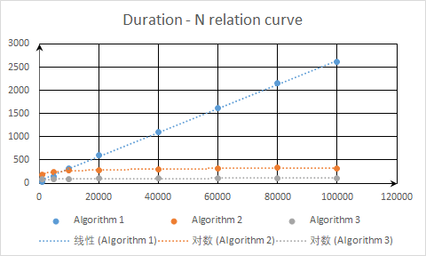
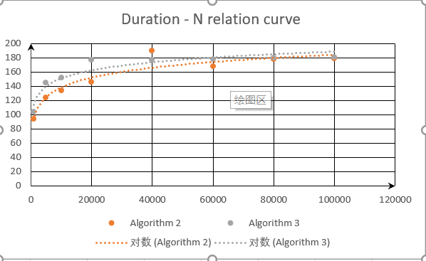

<center ><b><font size = '6'>The project report of experiment 1</font></b><center>

<center> Author Names: <u>Zong Weixu</u><center> 

<center> data : <u>2019 - 09 - 17 </u><center>

<hr>


## chapter 1 Problem Introduction

The problem given in Laboratory project 1 is Performance Measurement (POW). We could use different Algorithms to compute X<sup> N </sup> (N is a positive integer). However, different Algorithms have different complexities. To measure the performance of a function, we use C's standard library **time.h** to measure the performance of each Algorithms and evaluate the efficiency of each Algorithm.

<hr>

## chapter 2 Algorithm Specification

We design three Algorithms in total to solve this problem.

### Algorithm 1

#### the Implementation of Algorithm 1

According to the definition of power, It's easy to implement by using N - 1 multiplications.

```c
double result = 1;
for(int i = 0; i < n; i++){
	result = x * result;
}	// the result we finally get is the Nth power of X.
```

#### the Complexity of Algorithm 1

It' s obvious that the complexity of Algorithm 1 is O(N).

### Algorithm 2

#### the Implementation of Algorithm 2

We can use recursion to solve this problem. If N is even, X<sup> N </sup> = X<sup> N/2</sup> * X<sup> N/2 </sup>. If N is odd, X<sup> N </sup> = X<sup> (N-1)/2</sup> * X<sup> (N-1)/2 </sup> * X.   Consequently, we define X = 0, X = 1 as **base case**.  Then we can get the value of X<sup> N </sup> by calculate the value of X<sup> N/2</sup>.(making progress)

#### the Complexity of Algorithm 2

 If we use M times division. We can conclude that M must be less than log<sub>2</sub>N (when 2<sup>M</sup> = N) . Meanwhile, we do almost the same times multiplication. Consequently, the complexity of Algorithm 2 is O(log N).

```c
# Base case: n = 0, n = 1
if (n == 0) return 1;
if (n == 1) return 0;
# making progress:
if (n % 2) {
        double re = PowRecursive(x, n / 2);
        return re * re * x;
    } else {
        double re = PowRecursive(x, n / 2);
        return re * re;
    }
```

**Note**: You can see that our code is different from that mentioned in the textbook. Both of the methods use the same times multiplications and divisions. Because we use variable **re** to save the result of recursive function, our complexity is still O(log N).

__________________________________________________________________________________________________________________________________________________________________

### Algorithm 3

#### The Adventure of Algorithm 3

we can say that the Algorithm 2 is an effective Algorithm. However, when we do recursion, the computer push the function into stack which contains not only the parameters we use, but also the necessary information about the function. for example:

```asm
;we use the example in assembly language
;when we push the function into stack
push ebp ;stack base
mov ebp, esp ;initialize the top of stack
... ;deal with the function by using the stack,such as the information of the function...
mov esp ,ebp
pop ebp
ret ;the recursion finish
```

And obviously that it leads to unnecessary time and space allocation. Therefore, we can create a stack to record the parity of N during each circulation. As we only store the "state" of N, we don't need to spare time and space to deal with the function.

#### the Implementation of Algorithm 3

First of all, we create a stack to store the information. It's safe that the biggest number we can deal is X<sup>2<sup>100</sup></sup>. During the process,  we mod 2 and push the remainder into stack to record the parity of N. It keeps to compute until n = 0.

```c
while (n) {
        *(p++) = n % 2;
        n /= 2;
    }
```

Then we get the result by pop the result in stack, which determine the way of multiplication.

```c
while (p > stack) {
        if (*(--p))	  result = result * result * x;
       	else	result *= result;
    }
```

And we don't need to explicitly consider the base case of n = 0 and n = 1.

#### the Complexity of Algorithm 3

The Algorithm 3 do the multiplication and division as much as Algorithm 2. Thus, the complexity is still O(log N). However, we assume that Algorithm 3 is more efficient than 2. The iterative one optimized the memory consumption - only the data are loaded into memory.

<hr>

## chapter 3 Testing Results

#### the test Introdution

To confirms our hypothesis' validity, we can use **clock** to record the ticks when we run the function. We choose the condition: X = 1.0001 and N = 1000, 5000, 10000, 20000, 40000, 60000, 80000, 100000. As the function takes less than a tick to finish, we repeat the function for *K* times to obtain a total run time, and then divide the total time by *K* to obtain a more accurate duration for a single run of the function. According to the total time we test, we choose the *K* as 10000 for Algorithm 1 and 1000000 for the others. We guarantee the K is big enough so that the tick is at least 10.

#### the test Code

```c
static clock_t start, stop;
static clock_t ticks[8];
static int iternum[3] = {10000, 1000000, 1000000};
static int aryN[8] = {1000, ... ,100000}:
```

We use the array **aryN** to save the N we use to test. **Iternum** save the K times we run the function. And **ticks** save the time during we run the function for K times.

Then, we can run the three function and save the ticks when we run the function for K times. After that, we define function ***printResult*** to print the time for function. (Mark represent the index of each function.) We export the result as markdown files. The detail about ***printResult*** is omitted.

```c
for (int i = 0; i < 8; i++) {
    start = clock();
    for (int j = 0; j < iternum[0]; j++)
            result = PowClassic(1.0001, aryN[i]); 
    //Algorithm 1. In fact we can use a function pointer as the three "for" test use similar code.
    stop = clock();
    printf("%f\n", result);
    ticks[i] = stop - start;
    }
printResult(int mark);
```

#### the test Result

We test our result under different compilation environment.

##### Debugx64_clang

|            |            N            |    1000     |     5000     |    10000     |    20000     |     40000     |     60000     |     80000     |    100000     |
| :--------: | :---------------------: | :---------: | :----------: | :----------: | :----------: | :-----------: | :-----------: | :-----------: | :-----------: |
| Algorithm1 |      Iterations(K)      |    10000    |    10000     |    10000     |    10000     |     10000     |     10000     |     10000     |     10000     |
|            |          Ticks          |     38      |     164      |     339      |     700      |     1113      |     1615      |     2214      |     2614      |
|            | Total Times(milisecond) |  38.000000  |  164.000000  |  339.000000  |  700.000000  |  1113.000000  |  1615.000000  |  2214.000000  |  2614.000000  |
|            |  Duration(nanosecond)   | 3800.000000 | 16400.000000 | 33900.000000 | 70000.000000 | 111300.000000 | 161500.000000 | 221400.000000 | 261400.000000 |
| Algorithm2 |      Iterations(K)      |   1000000   |   1000000    |   1000000    |   1000000    |    1000000    |    1000000    |    1000000    |    1000000    |
|            |          Ticks          |     94      |     124      |     134      |     146      |      190      |      168      |      178      |      179      |
|            | Total Times(milisecond) |  94.000000  |  124.000000  |  134.000000  |  146.000000  |  190.000000   |  168.000000   |  178.000000   |  179.000000   |
|            |  Duration(nanosecond)   |  94.000000  |  124.000000  |  134.000000  |  146.000000  |  190.000000   |  168.000000   |  178.000000   |  179.000000   |
| Algorithm3 |      Iterations(K)      |   1000000   |   1000000    |   1000000    |   1000000    |    1000000    |    1000000    |    1000000    |    1000000    |
|            |          Ticks          |     104     |     145      |     152      |     177      |      177      |      178      |      180      |      181      |
|            | Total Times(milisecond) | 104.000000  |  145.000000  |  152.000000  |  177.000000  |  177.000000   |  178.000000   |  180.000000   |  181.000000   |
|            |  Duration(nanosecond)   | 104.000000  |  145.000000  |  152.000000  |  177.000000  |  177.000000   |  178.000000   |  180.000000   |  181.000000   |

##### Debugx64_gcc

|            |            N            |    1000     |     5000     |    10000     |    20000     |     40000     |     60000     |     80000     |    100000     |
| :--------: | :---------------------: | :---------: | :----------: | :----------: | :----------: | :-----------: | :-----------: | :-----------: | :-----------: |
| Algorithm1 |      Iterations(K)      |    10000    |    10000     |    10000     |    10000     |     10000     |     10000     |     10000     |     10000     |
|            |          Ticks          |     40      |     172      |     268      |     548      |     1342      |     1615      |     2019      |     2569      |
|            | Total Times(milisecond) |  40.000000  |  172.000000  |  268.000000  |  548.000000  |  1342.000000  |  1615.000000  |  2019.000000  |  2569.000000  |
|            |  Duration(nanosecond)   | 4000.000000 | 17200.000000 | 26800.000000 | 54800.000000 | 134200.000000 | 161500.000000 | 201900.000000 | 256900.000000 |
| Algorithm2 |      Iterations(K)      |   1000000   |   1000000    |   1000000    |   1000000    |    1000000    |    1000000    |    1000000    |    1000000    |
|            |          Ticks          |     65      |      95      |      90      |      96      |      101      |      105      |      109      |      112      |
|            | Total Times(milisecond) |  65.000000  |  95.000000   |  90.000000   |  96.000000   |  101.000000   |  105.000000   |  109.000000   |  112.000000   |
|            |  Duration(nanosecond)   |  65.000000  |  95.000000   |  90.000000   |  96.000000   |  101.000000   |  105.000000   |  109.000000   |  112.000000   |
| Algorithm3 |      Iterations(K)      |   1000000   |   1000000    |   1000000    |   1000000    |    1000000    |    1000000    |    1000000    |    1000000    |
|            |          Ticks          |     52      |      61      |      64      |      79      |      78       |      89       |      101      |      93       |
|            | Total Times(milisecond) |  52.000000  |  61.000000   |  64.000000   |  79.000000   |   78.000000   |   89.000000   |  101.000000   |   93.000000   |
|            |  Duration(nanosecond)   |  52.000000  |  61.000000   |  64.000000   |  79.000000   |   78.000000   |   89.000000   |  101.000000   |   93.000000   |

##### Debugx64_VisualStudio

|            |            N            |    1000     |     5000     |    10000     |    20000     |     40000     |     60000     |     80000     |    100000     |
| :--------: | :---------------------: | :---------: | :----------: | :----------: | :----------: | :-----------: | :-----------: | :-----------: | :-----------: |
| Algorithm1 |      Iterations(K)      |    10000    |    10000     |    10000     |    10000     |     10000     |     10000     |     10000     |     10000     |
|            |          Ticks          |     38      |     144      |     320      |     599      |     1102      |     1613      |     2147      |     2611      |
|            | Total Times(milisecond) |  38.000000  |  144.000000  |  320.000000  |  599.000000  |  1102.000000  |  1613.000000  |  2147.000000  |  2611.000000  |
|            |  Duration(nanosecond)   | 3800.000000 | 14400.000000 | 32000.000000 | 59900.000000 | 110200.000000 | 161300.000000 | 214700.000000 | 261100.000000 |
| Algorithm2 |      Iterations(K)      |   1000000   |   1000000    |   1000000    |   1000000    |    1000000    |    1000000    |    1000000    |    1000000    |
|            |          Ticks          |     185     |     250      |     281      |     288      |      301      |      322      |      329      |      325      |
|            | Total Times(milisecond) | 185.000000  |  250.000000  |  281.000000  |  288.000000  |  301.000000   |  322.000000   |  329.000000   |  325.000000   |
|            |  Duration(nanosecond)   | 185.000000  |  250.000000  |  281.000000  |  288.000000  |  301.000000   |  322.000000   |  329.000000   |  325.000000   |
| Algorithm3 |      Iterations(K)      |   1000000   |   1000000    |   1000000    |   1000000    |    1000000    |    1000000    |    1000000    |    1000000    |
|            |          Ticks          |     78      |      88      |      95      |     110      |      104      |      104      |      107      |      109      |
|            | Total Times(milisecond) |  78.000000  |  88.000000   |  95.000000   |  110.000000  |  104.000000   |  104.000000   |  107.000000   |  109.000000   |
|            |  Duration(nanosecond)   |  78.000000  |  88.000000   |  95.000000   |  110.000000  |  104.000000   |  104.000000   |  107.000000   |  109.000000   |

##### Debugx86_VisualStudio

|            |            N            |    1000     |     5000     |    10000     |    20000     |     40000     |     60000     |     80000     |    100000     |
| :--------: | :---------------------: | :---------: | :----------: | :----------: | :----------: | :-----------: | :-----------: | :-----------: | :-----------: |
| Algorithm1 |      Iterations(K)      |    10000    |    10000     |    10000     |    10000     |     10000     |     10000     |     10000     |     10000     |
|            |          Ticks          |     37      |     140      |     333      |     561      |     1047      |     1570      |     2179      |     2623      |
|            | Total Times(milisecond) |  37.000000  |  140.000000  |  333.000000  |  561.000000  |  1047.000000  |  1570.000000  |  2179.000000  |  2623.000000  |
|            |  Duration(nanosecond)   | 3700.000000 | 14000.000000 | 33300.000000 | 56100.000000 | 104700.000000 | 157000.000000 | 217900.000000 | 262300.000000 |
| Algorithm2 |      Iterations(K)      |   1000000   |   1000000    |   1000000    |   1000000    |    1000000    |    1000000    |    1000000    |    1000000    |
|            |          Ticks          |     214     |     269      |     291      |     333      |      338      |      336      |      370      |      349      |
|            | Total Times(milisecond) | 214.000000  |  269.000000  |  291.000000  |  333.000000  |  338.000000   |  336.000000   |  370.000000   |  349.000000   |
|            |  Duration(nanosecond)   | 214.000000  |  269.000000  |  291.000000  |  333.000000  |  338.000000   |  336.000000   |  370.000000   |  349.000000   |
| Algorithm3 |      Iterations(K)      |   1000000   |   1000000    |   1000000    |   1000000    |    1000000    |    1000000    |    1000000    |    1000000    |
|            |          Ticks          |     73      |      88      |      90      |      98      |      104      |      111      |      105      |      105      |
|            | Total Times(milisecond) |  73.000000  |  88.000000   |  90.000000   |  98.000000   |  104.000000   |  111.000000   |  105.000000   |  105.000000   |
|            |  Duration(nanosecond)   |  73.000000  |  88.000000   |  90.000000   |  98.000000   |  104.000000   |  111.000000   |  105.000000   |  105.000000   |

##### Releasex64_VisualStudio

|            |            N            |    1000     |    5000     |    10000     |    20000     |    40000     |    60000     |    80000     |    100000     |
| :--------: | :---------------------: | :---------: | :---------: | :----------: | :----------: | :----------: | :----------: | :----------: | :-----------: |
| Algorithm1 |      Iterations(K)      |    10000    |    10000    |    10000     |    10000     |    10000     |    10000     |    10000     |     10000     |
|            |          Ticks          |     18      |     76      |     118      |     264      |     455      |     705      |     953      |     1140      |
|            | Total Times(milisecond) |  18.000000  |  76.000000  |  118.000000  |  264.000000  |  455.000000  |  705.000000  |  953.000000  |  1140.000000  |
|            |  Duration(nanosecond)   | 1800.000000 | 7600.000000 | 11800.000000 | 26400.000000 | 45500.000000 | 70500.000000 | 95300.000000 | 114000.000000 |
| Algorithm2 |      Iterations(K)      |   1000000   |   1000000   |   1000000    |   1000000    |   1000000    |   1000000    |   1000000    |    1000000    |
|            |          Ticks          |     20      |     31      |      34      |      35      |      38      |      43      |      39      |      41       |
|            | Total Times(milisecond) |  20.000000  |  31.000000  |  34.000000   |  35.000000   |  38.000000   |  43.000000   |  39.000000   |   41.000000   |
|            |  Duration(nanosecond)   |  20.000000  |  31.000000  |  34.000000   |  35.000000   |  38.000000   |  43.000000   |  39.000000   |   41.000000   |
| Algorithm3 |      Iterations(K)      |   1000000   |   1000000   |   1000000    |   1000000    |   1000000    |   1000000    |   1000000    |    1000000    |
|            |          Ticks          |     18      |     23      |      28      |      29      |      31      |      32      |      33      |      33       |
|            | Total Times(milisecond) |  18.000000  |  23.000000  |  28.000000   |  29.000000   |  31.000000   |  32.000000   |  33.000000   |   33.000000   |
|            |  Duration(nanosecond)   |  18.000000  |  23.000000  |  28.000000   |  29.000000   |  31.000000   |  32.000000   |  33.000000   |   33.000000   |

##### Releasex86_VisualStudio

|            |            N            |    1000     |    5000     |    10000     |    20000     |    40000     |    60000     |    80000     |    100000     |
| :--------: | :---------------------: | :---------: | :---------: | :----------: | :----------: | :----------: | :----------: | :----------: | :-----------: |
| Algorithm1 |      Iterations(K)      |    10000    |    10000    |    10000     |    10000     |    10000     |    10000     |    10000     |     10000     |
|            |          Ticks          |     15      |     77      |     126      |     253      |     517      |     759      |     922      |     1146      |
|            | Total Times(milisecond) |  15.000000  |  77.000000  |  126.000000  |  253.000000  |  517.000000  |  759.000000  |  922.000000  |  1146.000000  |
|            |  Duration(nanosecond)   | 1500.000000 | 7700.000000 | 12600.000000 | 25300.000000 | 51700.000000 | 75900.000000 | 92200.000000 | 114600.000000 |
| Algorithm2 |      Iterations(K)      |   1000000   |   1000000   |   1000000    |   1000000    |   1000000    |   1000000    |   1000000    |    1000000    |
|            |          Ticks          |     24      |     31      |      35      |      38      |      42      |      42      |      43      |      44       |
|            | Total Times(milisecond) |  24.000000  |  31.000000  |  35.000000   |  38.000000   |  42.000000   |  42.000000   |  43.000000   |   44.000000   |
|            |  Duration(nanosecond)   |  24.000000  |  31.000000  |  35.000000   |  38.000000   |  42.000000   |  42.000000   |  43.000000   |   44.000000   |
| Algorithm3 |      Iterations(K)      |   1000000   |   1000000   |   1000000    |   1000000    |   1000000    |   1000000    |   1000000    |    1000000    |
|            |          Ticks          |     22      |     27      |      28      |      30      |      30      |      31      |      33      |      40       |
|            | Total Times(milisecond) |  22.000000  |  27.000000  |  28.000000   |  30.000000   |  30.000000   |  31.000000   |  33.000000   |   40.000000   |
|            |  Duration(nanosecond)   |  22.000000  |  27.000000  |  28.000000   |  30.000000   |  30.000000   |  31.000000   |  33.000000   |   40.000000   |

<hr>

## chapter 4 Analysis and Comments

#### the result Analysis

First of all, from the result(Duration) we get, we can evaluate the complexity of the three Algorithms. Under VIsualStudioDebugx64 condition, for example, We can see that as N grow in multiples, the duration of Algorithm 1 increase in linear while Algorithm 2 and Algorithm 3 in logarithmic growth. The function images in Figure 4.1 show the growth trends of each Algorithm.（Note: Algorithm 1's time unit is 10<sup>2</sup> ns)



<center>figure 4.1</center>
Then,from the image above, we can compare the result between different Algorithm. It's obvious that as N become big enough, it takes a long time for Algorithm 1 to compute the result of X<sup>N</sup>. Compare with Algorithm 1, Algorithm 2 and Algorithm 3 seems to grow in much slower trends. As we assume, we can see that the Algorithm 3 is more efficient than the other two Algorithms. We assume that Algorithm 3 is faster than 2 as it consume less space and time. However, during our test, we find that the condition different when we run the function under clangDebugx64 condition.(show in figure 4.2)



<center>figure 4.2</center>
We can see that if we use clang to compile, the advantage of Algorithm 3 is not so obvious. In other words, it sometimes even slower than Algorithm 2. We can't make out the exact reason of this. We assume that maybe clang do some optimization when it do recursion. 

And obviously, the duration we get from test varies with the compiler environment we use. For example, under the debug mode, gcc performs faster than the other compilers.

#### further possible Improvements

<hr>

## Declaration

we hereby declare that all the work done in this project titled "The project report of experiment 1" is of our independent effort as a group.

<hr>

## Duty Assignments:

Programmer: Xu Zhen
Tester: Chen Xiyao
Report Writer: Zong Weixu
